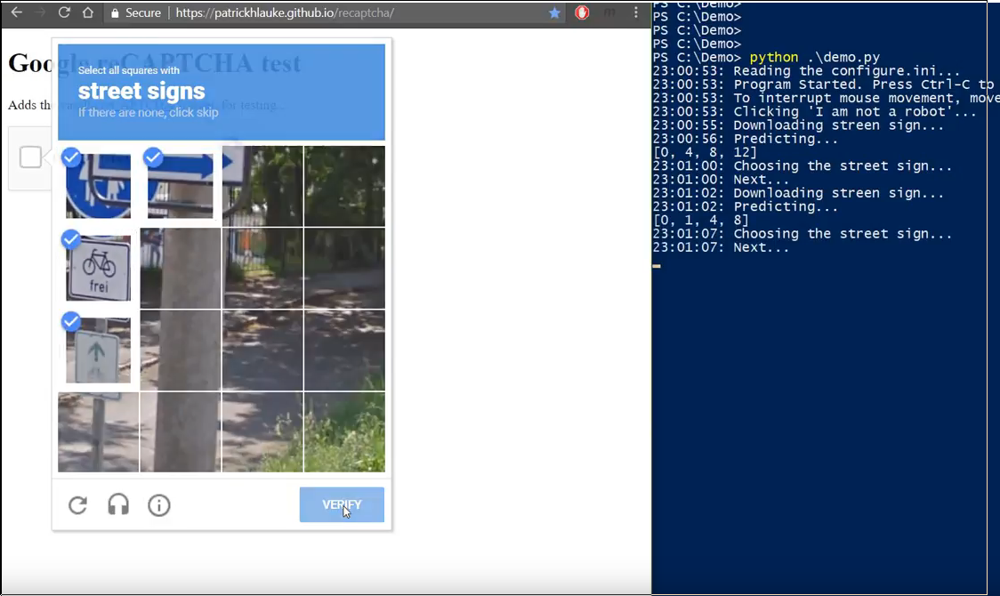

Read Me
====================

This is automation scripts to demonstrate solving google reCaptcha with deep learning. 
This version only works in Ubuntu 16.04 LTS.

Required
------------
* Python 3.6
* [pyautogui](https://pyautogui.readthedocs.io/en/latest/)
* [pyperclip](https://pypi.python.org/pypi/pyperclip)

File list
--------------
* demo.py/demo2.py: Demonstration of recaptcha solving for one-time or in infinit loop 
* configure.py: Read the configure_initial.ini to get the region info of all addressing images
    * The info in configure_initial.ini needs to be manually updated
    * Create the addressing images by taking screenshots
    * Get the locations of those addressing images
    * Save all info into configure.ini
* locations.py: Update the locations in configure.ini with existing addresing images. This assumes the existing addressing images are still valid.
* utilitize.py: Set of useful functions. 
    * imPath, clickImage, getIndices, rightClickImage... 
* streetSigns.py: Get 100 screenshots of street signs (only screenshots,needs to change to downloading)

Usage
-----
* This script assumes the test webpage on the left-half of screen, and the terminal on another half.
* Run the following script in the terminal
```python
python demo.py
```


TODO
------------------
* Implement the server-client version so that the model loading only needs to be done once at the begining.
* Repeat training procudure
* Simple shrink the boundary box by 20%. It works, but has space to be improved.
